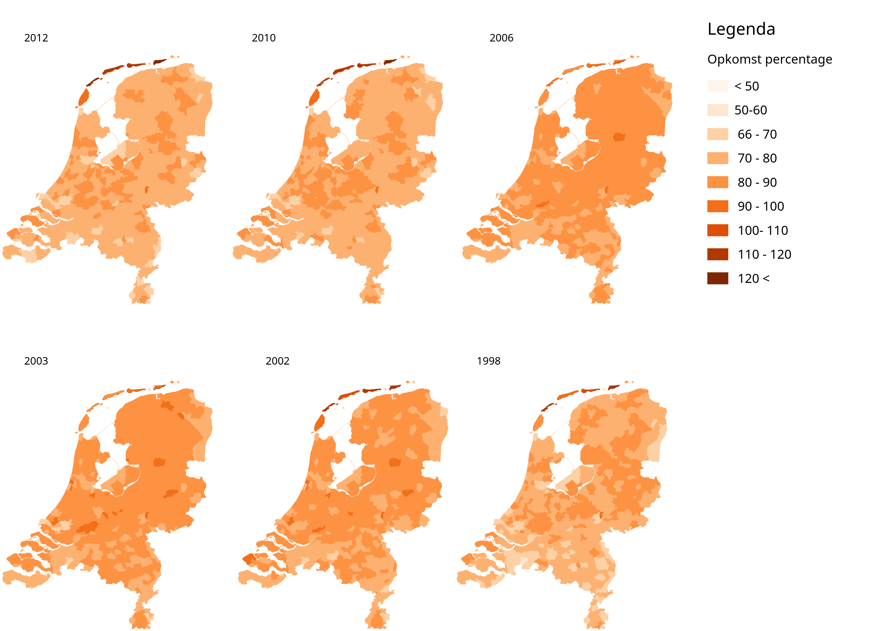
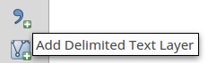
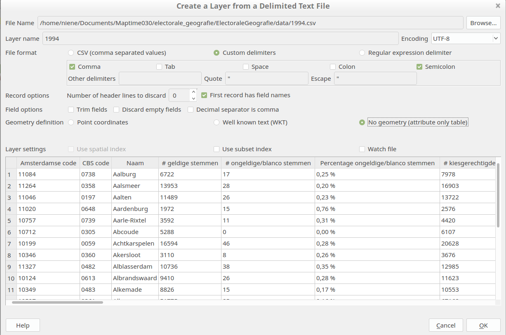
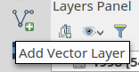
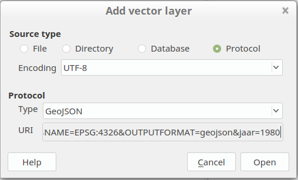
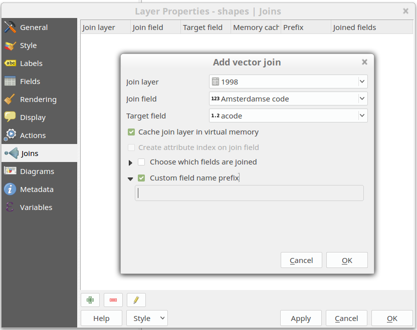

# Electorale Geografie

Data en tools voor Maptime030 over Electorale Geografie.

This tutorial will help you download the election results on municipality level, the municipality geometries of different years and how to join them in QGIS.

After that it is up to you to make a beautiful map and tell your story with the data!

**What do you need:**

- A laptop
- Wifi connection
- Download this repository on your computer 
- QGis

## Election results

The election results of the Tweede Kamerverkiezingen of all years can be downloaded at http://www.verkiezingsuitslagen.nl/Na1918/Verkiezingsuitslagen.aspx?VerkiezingsTypeId=1 and downloaded as csv files. We already downloaded some and can be found [here](/csv_downloads). But feel free to choose your own years to visualize! 

The CSV files contain the election results per municipality. Containing the CBS code and Amsterdamse code for the municipality. This is interesting because with this we can easily link them to the geometries!

But before that the CSV files do need some preparation:

### With the command line
To strip the csv files from the year overview and last 4 lines with the disclaimer, run this sed command on the files. It also adds an extra column with the year in it. This you have to fill in manually per file.  It also removes the % and # signs from the fields. 

	sed -e 's/$/,year/' -e 's/\%//g' -e 's/#//g' -n -e '1,/Amsterdamse/{x;d;};1h;1!{x;p;};${x;p;}' < inputfile.csv  |  head -n -4   > outputfile.csv

This is what we did:

	sed -e 's/$/,1994/' -e 's/\%//g' -e 's/#//g' -n -e '1,/Amsterdamse/{x;d;};1h;1!{x;p;};${x;p;}' < VerkiezingsuitslagenTK_1994.csv  | head -n -4  > 1994.csv
	sed -e 's/$/,1998/' -e 's/\%//g' -e 's/#//g' -n -e '1,/Amsterdamse/{x;d;};1h;1!{x;p;};${x;p;}' < VerkiezingsuitslagenTK_1998.csv  | head -n -4  > 1998.csv
	sed -e 's/$/,2002/' -e 's/\%//g' -e 's/#//g' -n -e '1,/Amsterdamse/{x;d;};1h;1!{x;p;};${x;p;}' < VerkiezingsuitslagenTK_2002.csv  | head -n -4  > 2002.csv
	sed -e 's/$/,2003/' -e 's/\%//g' -e 's/#//g' -n -e '1,/Amsterdamse/{x;d;};1h;1!{x;p;};${x;p;}' < VerkiezingsuitslagenTK_2003.csv  | head -n -4  > 2003.csv
	sed -e 's/$/,2006/' -e 's/\%//g' -e 's/#//g' -n -e '1,/Amsterdamse/{x;d;};1h;1!{x;p;};${x;p;}' < VerkiezingsuitslagenTK_2006.csv  | head -n -4  > 2006.csv
	sed -e 's/$/,2010/' -e 's/\%//g' -e 's/#//g' -n -e '1,/Amsterdamse/{x;d;};1h;1!{x;p;};${x;p;}' < VerkiezingsuitslagenTK_2010.csv  | head -n -4  > 2010.csv
	sed -e 's/$/,2012/' -e 's/\%//g' -e 's/#//g' -n -e '1,/Amsterdamse/{x;d;};1h;1!{x;p;};${x;p;}' < VerkiezingsuitslagenTK_2012.csv  | head -n -4  > 2012.csv

The stripped csv files can be found [here](/csv_edited). Now we have the election results in a nice CSV table. 

### HELP what is the command line?!
If you don't know how to run these command in your shell you can always just use Exel to edit the csv files manually! An easy task, just takes a bit more time. Or just use [these files](/csv_edited) that we prepared for you already! 

### Open the CSV files in Qgis

	Layer > Add Layer > Add Delimited Text Layer

Browse to your file location and put the settings on `No geometry (attribute only table)`. See picture below:

## Municipality geometries

To get the shapes from the municipalities per year we can request those at gemeentegeschiedenis.nl. 

### With the command line
`cd` to your folder and run the following codes to download the data.
All geometry shapes of the municipality of Utrecht in GeoJSON format can be requested at with their Amsterdamse Code. 

	curl http://www.gemeentegeschiedenis.nl/geo/geojson/10722 > utrecht_all.geojson

If you only want the geometry of one year :

	curl http://www.gemeentegeschiedenis.nl/geo/geojson/10722/1998 > utrecht_1998.geojson

### HELP what is the command line?!
If you don't know how to run these command in your shell you can also just copy the links in your browser. Then there are 2 options:

1. Open the link in the browser > Click right mouse button, `Save page as` and save as a text file. Manually type the extension when giving a file name. Like: `myfile.geojson` 
2. Open the link in the browser > Select all the text and copy this to a text editor. Save as a `.geojson` file.

The links you can use for all geometries of one municipality:

	http://www.gemeentegeschiedenis.nl/geo/geojson/10722

For the geometry of one year for one municipality:

	http://www.gemeentegeschiedenis.nl/geo/geojson/10722/1998

### But we want all municipalities of one specific year!? 

Let's add those directly to Qgis from the WFS service! :) 

Add a Layer
	
	Layer > Add Layer > Add Vector Layer

Select `Protocol` and put the following link in the `uri` field: 

	http://www.gemeentegeschiedenis.nl/cgi-bin/mapserv?map=gg.map&SERVICE=WFS&VERSION=1.1.0&REQUEST=GetFeature&TYPENAME=gemeenteref&SRSNAME=EPSG:4326&OUTPUTFORMAT=geojson&jaar=1980

Like this:

Open. Wait a little... TADA! 

Now right click the layer and `Save As...` a GeoJSON, ShapeFile ect. Add the saved file to the map, because we will work further with the saved file! 

We prepared [some Esri Shape files](/shapefiles) for you already. 

## Join!

To join the geometries with the information table we can make a join. 
Click with the `right mouse button` on the geometry layer. Go to `Properties`.
Open the tab `Joins` and add a new join. See the image below for the settings: 

If you now look at the attributes of the municipality geometries you see the attributes of the election results are added to the layer!
Ready for styling!

## Making maps!

### Cartogram Plugin

	Plugins > Manage and Install Plugins...
