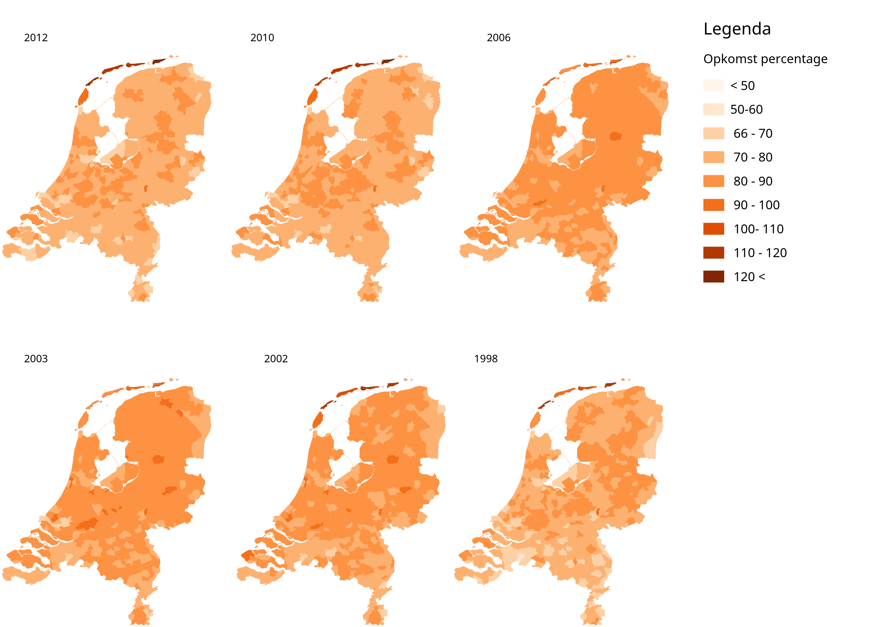
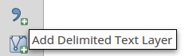
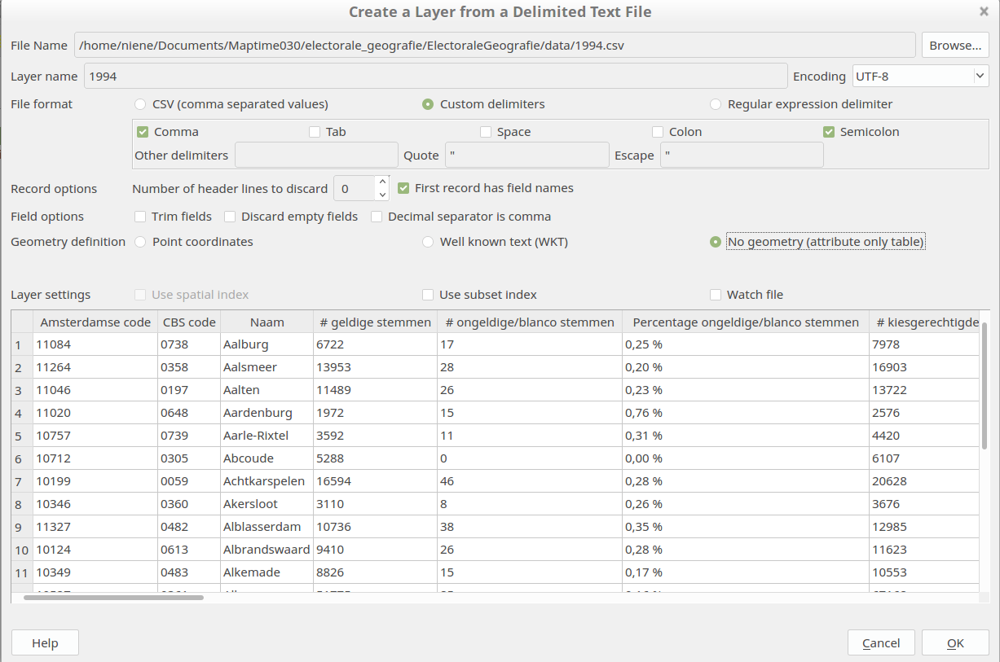
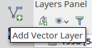
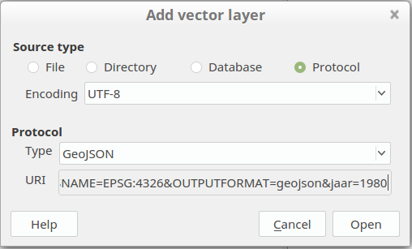
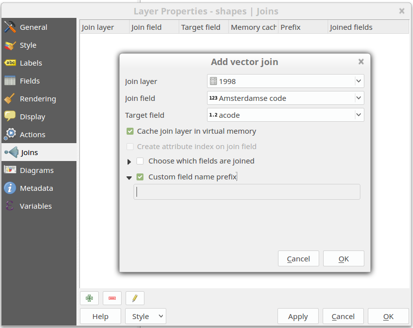

# Electorale Geografie

Data en tools voor Maptime030 over Electorale Geografie.

This tutorial will help you download the election results on municipality level, the municipality geometries of different years and how to join them in QGIS.

After that it is up to you to make a beautiful map and tell your story with the data!

**What do you need:**

- A laptop
- Wifi connection
- Download this repository on your computer 
- QGis

## Election results

The election results of the Tweede Kamerverkiezingen of all years can be downloaded at http://www.verkiezingsuitslagen.nl/Na1918/Verkiezingsuitslagen.aspx?VerkiezingsTypeId=1 and downloaded as csv files. We already downloaded some and can be found [here](/csv_downloads). But feel free to choose your own years to visualize! 

The CSV files contain the election results per municipality. Containing the CBS code and Amsterdamse code for the municipality. This is interesting because with this we can easily link them to the geometries!

But before that the CSV files do need some preparation:

### With the command line
To strip the csv files from the year overview and last 4 lines with the disclaimer, run this sed command on the files. It also adds an extra column with the year in it. This you have to fill in manually per file.  It also removes the % and # signs from the fields. 

	sed -e 's/$/,year/' -e 's/\%//g' -e 's/#//g' -n -e '1,/Amsterdamse/{x;d;};1h;1!{x;p;};${x;p;}' < inputfile.csv  |  head -n -4   > outputfile.csv

This is what we did:

	sed -e 's/$/,1994/' -e 's/\%//g' -e 's/#//g' -n -e '1,/Amsterdamse/{x;d;};1h;1!{x;p;};${x;p;}' < VerkiezingsuitslagenTK_1994.csv  | head -n -4  > 1994.csv
	sed -e 's/$/,1998/' -e 's/\%//g' -e 's/#//g' -n -e '1,/Amsterdamse/{x;d;};1h;1!{x;p;};${x;p;}' < VerkiezingsuitslagenTK_1998.csv  | head -n -4  > 1998.csv
	sed -e 's/$/,2002/' -e 's/\%//g' -e 's/#//g' -n -e '1,/Amsterdamse/{x;d;};1h;1!{x;p;};${x;p;}' < VerkiezingsuitslagenTK_2002.csv  | head -n -4  > 2002.csv
	sed -e 's/$/,2003/' -e 's/\%//g' -e 's/#//g' -n -e '1,/Amsterdamse/{x;d;};1h;1!{x;p;};${x;p;}' < VerkiezingsuitslagenTK_2003.csv  | head -n -4  > 2003.csv
	sed -e 's/$/,2006/' -e 's/\%//g' -e 's/#//g' -n -e '1,/Amsterdamse/{x;d;};1h;1!{x;p;};${x;p;}' < VerkiezingsuitslagenTK_2006.csv  | head -n -4  > 2006.csv
	sed -e 's/$/,2010/' -e 's/\%//g' -e 's/#//g' -n -e '1,/Amsterdamse/{x;d;};1h;1!{x;p;};${x;p;}' < VerkiezingsuitslagenTK_2010.csv  | head -n -4  > 2010.csv
	sed -e 's/$/,2012/' -e 's/\%//g' -e 's/#//g' -n -e '1,/Amsterdamse/{x;d;};1h;1!{x;p;};${x;p;}' < VerkiezingsuitslagenTK_2012.csv  | head -n -4  > 2012.csv

The stripped csv files can be found [here](/csv_edited). Now we have the election results in a nice CSV table. 

### HELP what is the command line?!
If you don't know how to run these command in your shell you can always just use Exel to edit the csv files manually! An easy task, just takes a bit more time. Or just use [these files](/csv_edited) that we prepared for you already! 

### Open the CSV files in Qgis

	Layer > Add Layer > Add Delimited Text Layer

Browse to your file location and put the settings on `No geometry (attribute only table)`. See picture below:

## Municipality geometries

To get the shapes from the municipalities per year we can request those from [gemeentegeschiedenis.nl](www.gemeentegeschiedenis.nl). If you want to download the official shape files you can get those from the [CBS](https://www.cbs.nl/nl-nl/dossier/nederland-regionaal/geografische-data).

### We want all municipalities of one specific year in QGIS!

Let's add those directly to Qgis from the WFS service! :) 

Add a Layer
	
	Layer > Add Layer > Add Vector Layer

Select `Protocol` and put the following link in the `uri` field. See that the last bit contains the year? Change that to any year you want from 1812 untill now! 

	http://www.gemeentegeschiedenis.nl/cgi-bin/mapserv?map=gg.map&SERVICE=WFS&VERSION=1.1.0&REQUEST=GetFeature&TYPENAME=gemeenteref&SRSNAME=EPSG:4326&OUTPUTFORMAT=geojson&jaar=1980

Like this:

Open. Wait a little... TADA! 

Now right click the layer and `Save As...` a GeoJSON, ShapeFile ect. Add the saved file to the map, because we will work further with the saved file! 

We also prepared [some Esri Shape files](/shapefiles) for you already wich you can also download and open in QGIS. 

## Join!

To join the geometries with the information table we can make a join. 
Click with the `right mouse button` on the table containing the **geometries**! Go to `Properties`.
Open the tab `Joins` and add a new join. We will join the information from our CSV file to the geometries with a matching attribute.
See the image below for the settings: 

If you now look at the attributes of the municipality geometries you see the attributes of the election results are added to the layer!
Ready for styling!

## Making maps!
Now it is time for you to make some maps! In order to show what we want, we can use the `field calculator` in QGIS, or edit our CSV (in excel for example) before joining them in Qgis. 
Here are some ideas to visualize:

* Vergelijkingen over tijd zijn mooi. Zoals je de kaarten met opkomst naast elkaar hebt staan, zo kun je ook kaarten per partij maken. Dus de score van die partij. Wat ook kan is de relatieve score per partij. Dus score tov landelijk gemiddelde ipv absolute score, dan zie je hoe partijen over de tijd verschuiven (bv Limburg is nog steeds PVV bolwerk, maar de groei zit in het noorden). 

* Combinaties van partijen. B.v. links of rechts, of 'groen' of 'populistisch'. Ook dat kun je mooi vergelijken over de tijd. Er zijn bijvoorbeeld linkse gebieden van de kaart verdwenen, zoals het Rivierenland. Ook is het leuk om te kijken in hoeverre gemeenten afwijken van het gemiddelde. Of te kijken hoe vaak een gemeente op de landelijk winnende partij heeft gestemd. 

* Winsten en verliezen zijn ook leuk om naar te kijken. Waar zitten de absolute en relatieve verliezen van partijen? 

* voor de gevorderden. Die cartogrammen, waarbij de kaart vervormd naar inwoneraantal, die zijn natuurlijk leuk. Leuk om die voor alle partijen te maken. Dus inwoneraantal, en dan hoe donkerder hoe meer aanhang. Of ze vervormen op basis van het aantal stemmen voor die partij. Dus een opgeblazen Limburg voor de PVV bv. En nog veel verder opgeblazen steden voor GroenLinks. 

	Plugins > Manage and Install Plugins...  > Cartogram

* En andere visualisaties. Stippen voor de hoeveelheid stemmen per partij in een gemeente. Of staafjes die aangeven hoeveel stemmen er voor een partij in een gemeente waren. 3D modellen waarbij gemeenten met veel inwoners omhoog komen. Dat soort dingen hebben we in de VS gezien. Of dat een gemeente donkerder kleurt als er meer mensen wonen, waardoor je beter zie hoe de waarde van een gemeente is voor een partij. 

