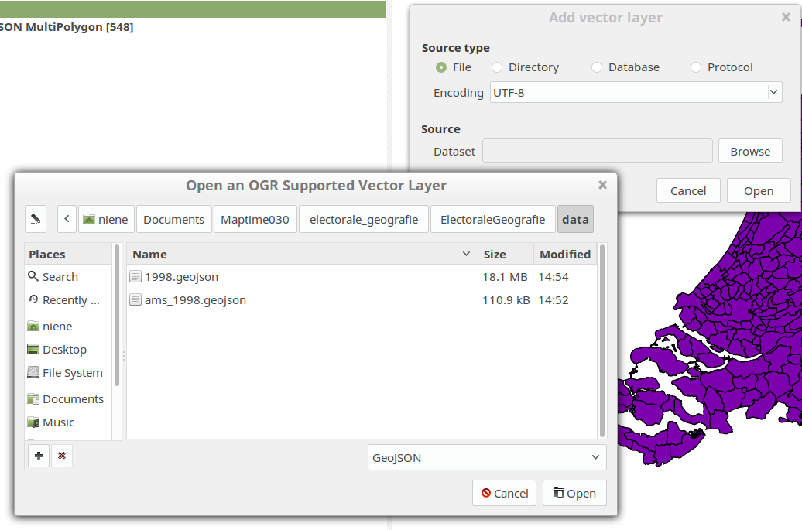

# Electorale Geografie

Data en tools voor Maptime030 over Electorale Geografie

## Election results

Download the data from http://www.verkiezingsuitslagen.nl/Na1918/Verkiezingsuitslagen.aspx?VerkiezingsTypeId=1 and save the csv file of the year you want to map. We already downloaded some and can be found [here](/downloads). 

To strip the csv files from the year overview and last 4 lines with the disclaimer, run this sed command on the files. It also adds an extra column with the year in it. This you have to fill in manually per file. 

	sed -e 's/$/,year/' -n -e '1,/Amsterdamse/{x;d;};1h;1!{x;p;};${x;p;}' < inputfile.csv  | head -n -4  > outputfile.csv

This is what we did:

	sed -e 's/$/,1994/' -n -e '1,/Amsterdamse/{x;d;};1h;1!{x;p;};${x;p;}' < VerkiezingsuitslagenTK_1994.csv  | head -n -4  > 1994.csv
	sed -e 's/$/,1998/' -n -e '1,/Amsterdamse/{x;d;};1h;1!{x;p;};${x;p;}' < VerkiezingsuitslagenTK_1998.csv  | head -n -4  > 1998.csv
	sed -e 's/$/,2002/' -n -e '1,/Amsterdamse/{x;d;};1h;1!{x;p;};${x;p;}' < VerkiezingsuitslagenTK_2002.csv  | head -n -4  > 2002.csv
	sed -e 's/$/,2003/' -n -e '1,/Amsterdamse/{x;d;};1h;1!{x;p;};${x;p;}' < VerkiezingsuitslagenTK_2003.csv  | head -n -4  > 2003.csv
	sed -e 's/$/,2006/' -n -e '1,/Amsterdamse/{x;d;};1h;1!{x;p;};${x;p;}' < VerkiezingsuitslagenTK_2006.csv  | head -n -4  > 2006.csv
	sed -e 's/$/,2010/' -n -e '1,/Amsterdamse/{x;d;};1h;1!{x;p;};${x;p;}' < VerkiezingsuitslagenTK_2010.csv  | head -n -4  > 2010.csv
	sed -e 's/$/,2012/' -n -e '1,/Amsterdamse/{x;d;};1h;1!{x;p;};${x;p;}' < VerkiezingsuitslagenTK_2012.csv  | head -n -4  > 2012.csv

The stripped csv files can be found [here](/data). Now we have the election results in a nice CSV table. 

## Municipality geometries

To get the shapes from the muncipalities per year we can request those at gemeentegeschiedenis.nl. 

#### With the command line
`cd` to your folder and run the following codes to download the data.
All geometry shapes of the municipality of Utrecht in json format can be requested at with their Amsterdamse Code. 

	curl http://www.gemeentegeschiedenis.nl/geo/geojson/10722 > utrecht_all.geojson

If you only want the geometry of one year :

	curl http://www.gemeentegeschiedenis.nl/geo/geojson/10722/1998 > utrecht_1998.geojson

Now, if we want all municipalities of the Netherlands for a given year:

	curl http://gemeentegeschiedenis.nl/cgi-bin/mapserv?map=gg.map&LAYERS=gemeenteref&JAAR=1998&FORMAT=image/png&SRS=EPSG:28992&EXCEPTIONS=application/vnd.ogc.se_inimage&TRANSPARENT=TRUE&SERVICE=WMS&VERSION=1.1.1&REQUEST=GetMap&STYLES=&BBOX=-50485.12,395620.290625,352743.68,533476.290625&WIDTH=1170&HEIGHT=400 > nederland_1998.geojson

#### HELP what is the command line?!
If you don't know how to run these command in your shell you can also just copy the links in your browser. Then there are 2 options:

1. Select all the text and copy this to a text editor. Save as a `.geojson` file.
2. Click right mouse button, `Save page as` and save as a text file. Manually type the extension when giving a file name. Like: `myfile.geojson` 

The links you can use for all geometries of one municipality:

	http://www.gemeentegeschiedenis.nl/geo/geojson/10722

For the geometry of one year for one municipality:

	http://www.gemeentegeschiedenis.nl/geo/geojson/10722/1998

All municipalities of the Netherlands for one year

	http://gemeentegeschiedenis.nl/cgi-bin/mapserv?map=gg.map&LAYERS=gemeenteref&JAAR=1998&FORMAT=image/png&SRS=EPSG:28992&EXCEPTIONS=application/vnd.ogc.se_inimage&TRANSPARENT=TRUE&SERVICE=WMS&VERSION=1.1.1&REQUEST=GetMap&STYLES=&BBOX=-50485.12,395620.290625,352743.68,533476.290625&WIDTH=1170&HEIGHT=400

## QGis

Open both layers of one year in Qgis. The geometries and the CSV file.

1. Open the GeoJSON
	
	Layer > Add Layer > Add Vector Layer

Browse to your file location and change the file format to GeoJSON! See picture below:

2. Open the CSV file

	Layer > Add Layer > Add Delimeted Text Layer

Browse to your file location and put the settigns on `No geometry (attribute only table)`. See picture below:

## Cartogram Plugin

	Plugins > Manage and Install Plugins...
